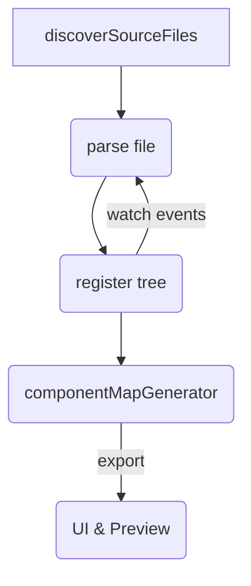

# Implementation Plan v0.2 — **AST‑Centric Roadmap (Full)**

> *This supersedes Implementation Plan v0.1.*  
> All phases are shown in sequence, even where tasks are unchanged.

---

## 🔄 Key Changes from v0.1

| Area | Change |
|------|--------|
| **AST-first architecture** | Phase 3 introduces a global **AST Registry** parsed at mount time; everything else consumes it. |
| **Dynamic `componentMap`** | Generated in Phase 3, consumed in Phase 4 (no duplication). |
| **Safe code‑gen layer** | Added Recast + Prettier for loss‑less printing; canvas edits go through AST transforms instead of string slicing. |
| **File watching** | Live registry refresh via `fs.watch` inside WebContainer. |
| **Tickets updated** | Inspector/Canvas refactored to use new `applyCanvasPatch` API. |

---

## Phase 1 – Core Infrastructure & Public GitHub Loading *(completed)*
_No scope changes; retained for completeness._

1. Next.js + Tailwind scaffold
2. Radix UI / shadcn primitives (Button, Input)
3. GitHub unauthenticated repo fetch (Octokit)
4. Monaco Editor embed
5. COOP/COEP headers for WebContainer compatibility

---

## Phase 2 – WebContainer & Virtual FS *(watch‑ready)*

| Task | Output |
|------|--------|
| Integrate `@webcontainer/api` | WebContainer boots in provider `useWebContainer` |
| Mount repo into `/project` | GitHub files live in VFS |
| Filesystem helpers | `mount`, `readFile`, `writeFile`, `mkdir`, `rm` |
| **NEW:** `watchDirectory()` + `useFileWatcher` | Emits `file:add`, `file:change`, `file:unlink` events |

---

## Phase 3 – **AST Core & Component Indexer** ★

### Goal
Single source‑of‑truth **AST Registry** + **componentMap**.

### Deliverables
- `tree-sitter-javascript.wasm`, `tree-sitter-tsx.wasm`
- `lib/ast/parser.ts` → `getParser(ext)`
- `hooks/useAstRegistry.ts` (React Context)
- `lib/ast/componentMapGenerator.ts` → `{componentMap, inverseMap}`
- Jest tests for export detection, anonymous fallback, hot‑refresh

### Pipeline


---

## Phase 4 – Design Mode: Isolated Vite Preview

1. Auto‑generate `/preview-app` scaffold (Vite, alias `@user-project → /project/src`)
2. Write **dynamic `componentMap.js`** (from Phase 3) into preview app
3. `PreviewLoader.tsx` uses URL param `?componentName=` to `lazy()` import via alias
4. `ComponentPreview.tsx` resolves selected file → component via `inverseMap`
5. Post‑message `componentMapUpdated` → iframe reload when map changes
6. Relies on Vite HMR for code updates

---

## Phase 5 – Code ↔ Design Sync & Inspector (AST Edits)

| Layer | Detail |
|-------|--------|
| **Deps** | `recast`, `@babel/parser`, `prettier`, `chokidar` |
| **Code‑gen** | `lib/ast/codegen.ts` → `printAst(tree)`
| **Patch API** | `applyCanvasPatch(patch)` → mutate AST → regenerate source → `writeFile` |
| **Inspector** | Now calls `applyCanvasPatch`; drops string‑replace logic |
| **Sockets** | Payloads may send `{diff}` not whole file |
| **E2E** | Canvas edit → HMR → Editor & Preview stay in sync

---

## Phase 6 – Interactive Preview & Execution

Unchanged functionally; verify that AST‑driven writes still trigger HMR.  Includes:
- spawn dev server (`npm run dev`) via WebContainer process API
- capture preview URL (`server-ready`)
- iframe `LivePreview.tsx`

---

## Phase 7 – AI Agent Integration

- Tools `readFile`, `editFile` now leverage AST Registry + Code‑gen to guarantee compilable edits.
- Chat endpoint streams responses; UI uses `@ai-sdk/react`.

---

## Phase 8 – Advanced / Backlog *(placeholders)*
- Intent‑ingestion hub (Figma import, GitHub PR sync)
- Embeddings / knowledge graph
- Collaboration (presence, comments)
- Performance audits & test harnesses

---

## File‑Structure Adjustments
```
src/
  hooks/
    useAstRegistry.ts   # NEW
  lib/
    ast/
      parser.ts         # getParser()
      componentMapGenerator.ts  # NEW
      codegen.ts        # NEW
      traversal.ts      # updated
      reactComponentUtils.ts  # removed (merged)
```

---

## New Dependencies
```json
{
  "recast": "^0.23",
  "prettier": "^3.3",
  "chokidar": "^3.6"
}
```

---

### Migration Notes
- Delete Phase 4 legacy map builders; *always* import `componentMap` from Phase 3.
- Any canvas edit must go through `applyCanvasPatch` → no direct string writes.

---

_End of Implementation Plan v0.2_

