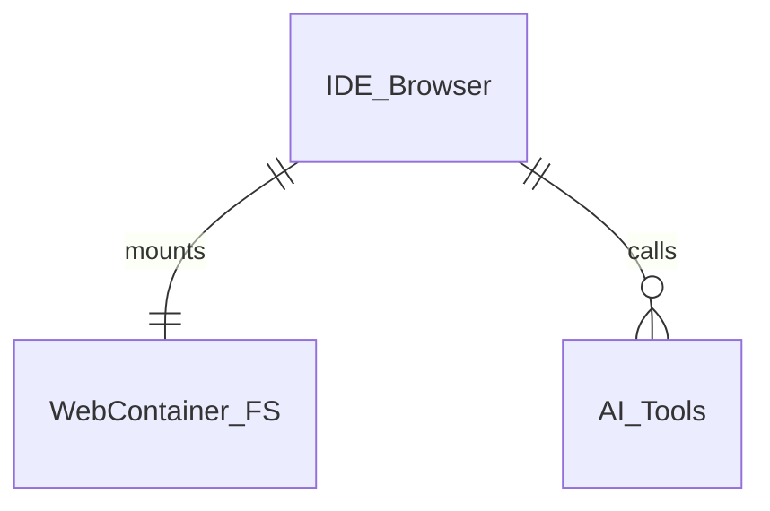

# 21st Gen IDE — Core Module Specification
_Version 0.1 • April 25 2025_

---
## Table of Contents
1. File‑System Layer (WebContainer FS)
2. AST Engine
3. WebContainer Runtime
4. Code Tab (Monaco)
5. Design Canvas Tab (React‑Flow)
6. Cross‑Module Events & Data Contracts
7. End‑to‑End User Stories

---
## 1 · File‑System Layer (WebContainer FS)
### Purpose
Single source of truth for every file during a design session. Acts like a tiny hard‑drive that both the browser and AI agent can read/write.

### Key Features
| ID | Feature | Notes |
|----|---------|-------|
| FS‑01 | **Branch checkout** | If `branch` is provided and exists → `git checkout branch`. If not provided → `git checkout -b initiative/<slug>` and trigger repo ingest. |
| FS‑02 | **Live watch API** | Emits `FileChanged(path)` on every save (user, AI, or tool). |
| FS‑03 | **CRUD helpers for AI** | `readFile`, `writeFile`, `deleteFile`, `listFiles`. |
| FS‑04 | **Persistence on Publish** | `git commit && git push` triggered only on Publish. |

### Implementation Overview

* Uses native **WebContainer** FS methods (`fs.readFile`, `fs.writeFile`).
* File‑events forwarded over RPC (`postMessage`) to the Design & Code tabs.

---
## 2 · AST Engine
### Purpose
Translate code ↔ blueprint; enable surgical edits and Canvas synchro.

### Responsibilities
1. **Parse** every `.ts`/`.tsx` file with **Tree‑sitter** (JavaScript/TypeScript grammar) → JSON AST (supports incremental parsing).
2. Keep **`astState`** (Valtio proxy) in browser memory.
3. Apply **patches** from Inspector or AI (`editAst`).
4. Re‑parse only the changed file on every `FileChanged`.

### Features
| ID | Feature | Detail |
|----|---------|--------|
| AST‑01 | File‑level parse | `parse(sourceFile)` returns `{ nodes, edges }`. |
| AST‑02 | Incremental patch | JSON‑Patch RFC 6902 on node props/layout. |
| AST‑03 | Node→file mapping | Each node stores `filePath`, `range` for AI targeting. |
| AST‑04 | Edges extraction | `IMPORTS`, `ROUTES_TO`; stored in `astState.edges`. |
| AST‑05 | **Component Map Generation** | **Traverses parsed `.tsx`/`.jsx` files, identifies default exports, and generates a map `{ ComponentName: relativeFilePath }` for the Preview app.** |

### Performance Targets
* Parse 1 kLoC in < 200 ms.  
* Patch & re‑render node in < 50 ms.

---
## 3 · WebContainer Runtime
### Purpose
Provides Node + dev‑server so Canvas can import compiled modules and users can run `pnpm dev`.

### Boot Sequence
```bash
pnpm install         # cache layer
pnpm dev             # Vite / Next – Fast Refresh
```
* Exposes port **5173** → auto‑proxy to `https://<wc-host>/5173`.

### Events
* `DevServerReady(port)` once server listening.  
* Forwards Vite HMR to browser → Canvas hot‑reloads.
* **Relies on dynamically generated component map (`componentMap.js`) injected by AST Engine/associated logic.**

---
## 4 · Code Tab
### Stack
* **Monaco Editor** (VS Code core) running in browser.
* File tree reflects WebContainer FS.

### Features
| ID | Feature | Notes |
|----|---------|-------|
| CODE‑01 | Syntax Highlight + TS IntelliSense | Uses `monaco‑typescript` worker. |
| CODE‑02 | Auto‑save | `ctrl+s` → `writeFile` → `FileChanged`. |
| CODE‑03 | Diff gutter | Shows unsaved vs branch HEAD (from Git API). |
| CODE‑04 | Quick‑Fix with AI | Select lines → context menu "Ask AI" → assistant gets filePath + range. |

---
## 5 · Design Canvas Tab
### Rendering Pipeline
1. **Filter** `astState.nodes` by `selectedFolder`.
2. **Build nodes**: `{ id, ReactComponent, props, layoutMeta }`.
3. **Build edges**: include only edges where _both_ ends in visible node list; dashed "ghost" edge for out‑of‑scope targets.
4. **React‑Flow** renders nodes & edges.
5. **Inspector** writes JSON‑patches to `astState`.

### Canvas Features
| ID | Feature | Detail |
|----|---------|--------|
| CAN‑01 | Drag / resize nodes | Updates layout props (`className`, inline style). |
| CAN‑02 | Prop edit inspector | Two‑way binds to `astState`. |
| CAN‑03 | Node selection → chat | Sends node metadata to AI for contextual commands. |
| CAN‑04 | Edge toggles | Toolbar: _Show Routes_, _Show Imports_. |

---
## 6 · Cross‑Module Events & Contracts
| Event | Emitter | Payload | Subscribers |
|-------|---------|---------|-------------|
| `FileChanged` | File System | `{ path }` | AST Engine, Code Tab, Design Canvas |
| `AstPatched` | AST Engine | `{ nodeId, patch }` | Canvas (re‑render), Code Tab (highlight) |
| `DevServerReady` | WebContainer | `{ port }` | Canvas module loader |
| `AiWriteFile` | AI Tools | `{ path }` | File System (write), AST Engine (re‑parse) |

---
## 7 · User Stories (System Walkthrough)
### Story 1 · Designer builds a Sign‑Up form visually
1. **Selects** `src/ui/auth/` in file tree → Canvas shows Login & Signup pages.
2. **Drags** an `Input` node from palette into SignupForm.  
   *Canvas*: adds JSX element → `AstPatched` event.  
   *Code Tab*: file auto‑updates.
3. **Changes** button color in Inspector → `AstPatched` → React Fast‑Refresh shows blue button.
4. **Hits Preview** → Dev‑server URL opens, full flow works.

### Story 2 · PM asks AI to add validation
1. **Clicks** the Password field node → sends node meta to chat.
2. Types → "Add strength meter & min length 8".
3. **AI** runs:
   - `readFile(Signup.tsx)`  
   - edits JSX & logic → `AiWriteFile`  
   - AST re‑pars

